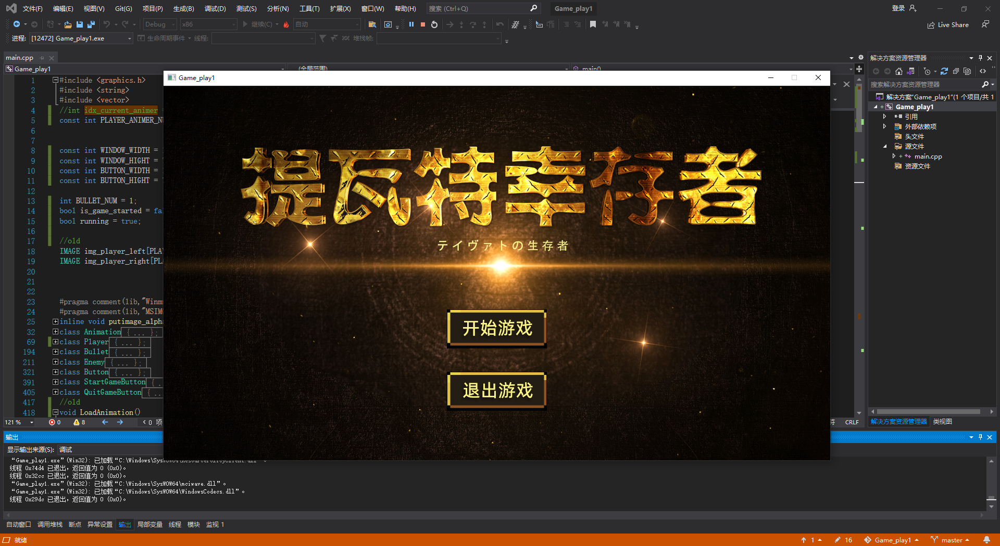
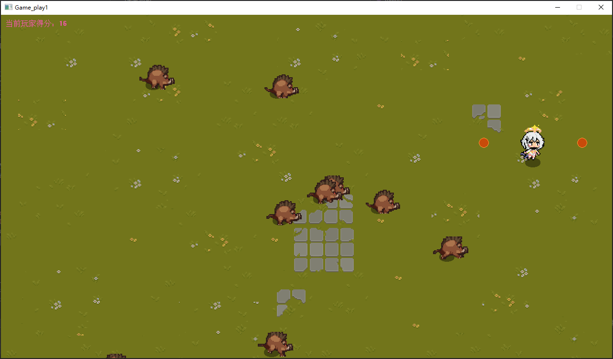
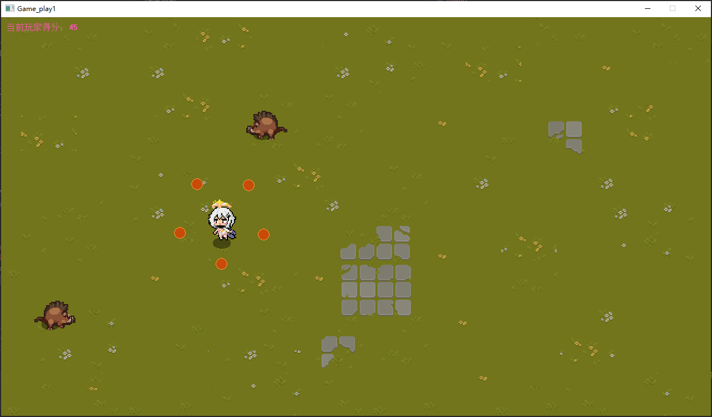
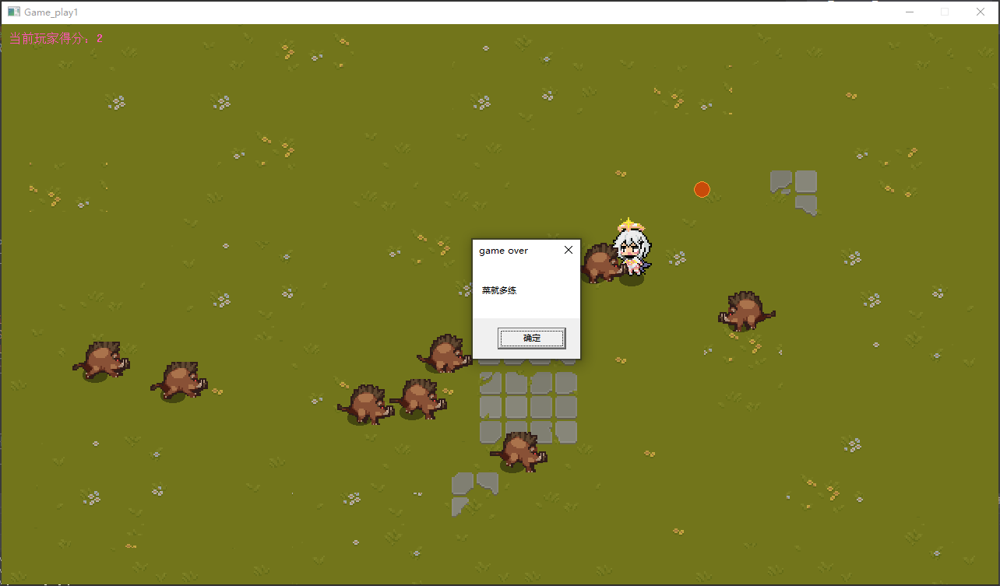

# C++ 小游戏开发

## 项目简介
本项目是一个基于 C++ 的游戏开发项目，旨在展示如何使用 C++ 和 EasyX 库制作的游戏。项目包括加载和渲染图片资源、实现角色动画、优化角色移动等功能。
## 游戏截图

## 项目内容
- 加载和渲染图片资源
- 实现角色动画（序列帧动画）
- 优化角色移动（解决卡顿问题）
- 实现面向对象的思想在游戏中的应用
- 
## 如何运行
1. 克隆本仓库到本地
2. 下载并使用 EasyX 库编译和在点击sln解决方案，在vs2019运行项目代码
3. 按照视频教程中的步骤加载图片资源、实现动画和角色移动

## 文件结构
- `main.cpp`: 主程序文件，包含游戏的主要逻辑
- `images/`: 存放游戏所需的图片资源
- `README.md`: 项目说明文档

## 注意事项
- 请确保安装 EasyX 库
- 在运行程序时，注意调整窗口大小和位置以获得最佳显示效果

## 后续计划
- 继续完善游戏，加入更多玩法
- 编写野猪的刷新和索敌逻辑
- 更多游戏开发技术分享
  
原up链接：https://www.bilibili.com/video/BV1iQ4y1s7Qj/?spm_id_from=333.788&vd_source=367eeb5a3b579cd7dc4933ec96d49653

